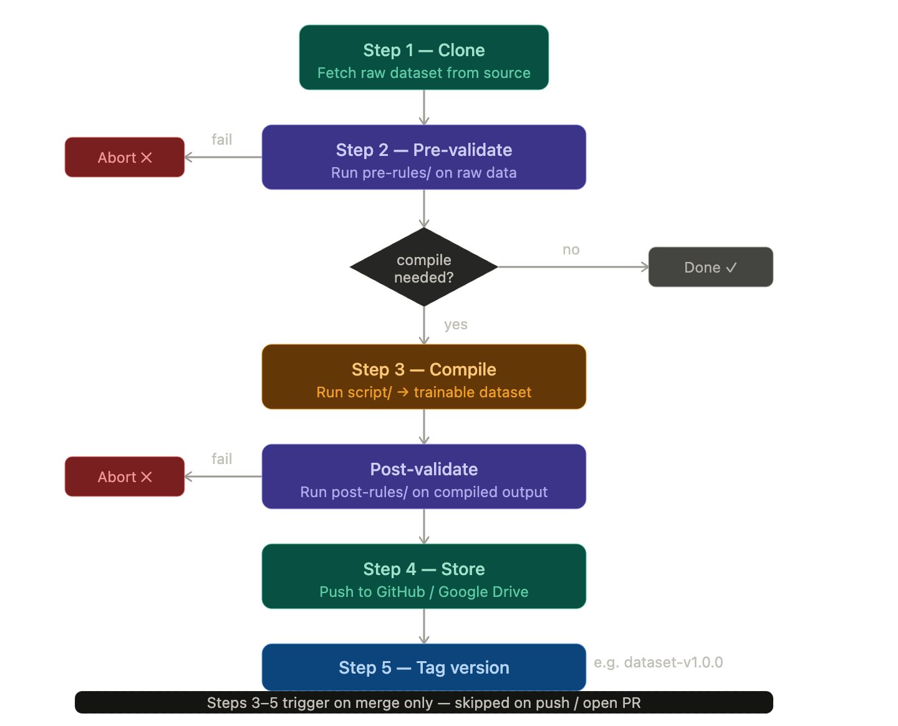

# Dataset Template

A standardised template for managing ML datasets — from raw source through validation, compilation, and storage. Clone this repo to create a new dataset store that plugs directly into the research pipeline.

---

## Repository structure

```
.
├── dataset/                        # Raw dataset files
│   └── <data files>                # Raw files (e.g. raw_file.csv)
│
├── scripts/
│   ├── download/
│   │   └── download.py             # Fetches the dataset if stored remotely
│   │
│   ├── pre-rules/
│   │   └── validate.py             # Validates raw data before compilation; exits non-zero on failure
│   │
│   ├── compile/
│   │   └── compile.py              # Transforms raw data → trainable dataset format
│   │
│   └── post-rules/
│       └── validate.py             # Validates compiled data after compilation; exits non-zero on failure
│
└── manifest.yaml                   # Pipeline control (see below)
```

---

## Configuration

`manifest.yaml` controls the pipeline behaviour for each dataset version.

```yaml
version: "1.0.0"

input:
  source: "github"          # github | remote
                            # github: dataset lives in dataset/; remote: use download script

output:
  name: "my-dataset-train"  # name of the compiled dataset artifact
  folder_path: "~/folder/to/store"
  destination: "gdrive"     # gdrive | huggingface | idrive2

remote:
  gdrive:
    folder_id: ""           # Google Drive folder ID to upload into
  huggingface:
    repo_id: ""             # e.g. your-org/my-dataset
    repo_type: "dataset"    # dataset | model | space
    private: true
  idrive2:
    bucket: ""
    region: ""
    endpoint: ""

steps:
  pre-rules:
    enabled: true
    script: "scripts/pre-rules/validate.py"
  compile:
    enabled: true
    script: "scripts/compile/compile.py"
    extensions: [".jsonl", ".parquet", ".arrow"]  # empty = accept all
  post-rules:
    enabled: true
    script: "scripts/post-rules/validate.py"
  tag:
    enabled: true
    prefix: "dataset"           # tag format: <prefix>-v<version>-<suffix>
    suffix: "train"
    github-branch: "main"
    dvc-file: "dvc.yaml"

dependencies:
  - name: "pandas"
    version: "1.5.0"
  - name: "numpy"
    version: "1.20.0"

variables:                        # custom variables passed to all scripts
  example: "example"
```

---

## Pipeline



**Steps 3–5 are gated on merge.** To avoid abusing CI resources, compilation, storage, and tagging only run when a pull request is merged into the main branch. On regular pushes and open PRs, the pipeline runs Steps 1–2 only (clone + pre-validate), giving fast feedback without triggering expensive operations.

**Validation gates compilation.** Step 3 will not start unless pre-validation exits successfully. Similarly, Step 5 will not run unless post-validation passes. A failed validation in either gate aborts the pipeline and surfaces the error in CI.

**Tagging creates a reproducible reference.** The final step writes a Git tag in the format `<prefix>-v<version>-<suffix>` (e.g. `dataset-v1.0.0-train`) on the storage branch after a successful store. This ties the compiled artifact permanently to the `version` field in `manifest.yaml`, making any past dataset version fully reproducible from CI history.

---

## Implementing this template

1. **Declare your source** — Set `input.source` in `manifest.yaml`. Use `github` to store raw files directly in `dataset/`, or `remote` to pull them via `scripts/download/download.py`.

2. **Write your download script** *(remote sources only)* — Implement `scripts/download/download.py`. The `download(filename, filepath, variables)` function should fetch the file and return `True` on success.

3. **Write your validators** — Implement `scripts/pre-rules/validate.py` and `scripts/post-rules/validate.py`. Both scripts should exit `0` on success and non-zero with a descriptive error on failure.

4. **Write your compilation script** — Implement `scripts/compile/compile.py`. The `compile(input_path, output_path, variables)` function should transform raw data into the format your training pipeline expects and return `True` on success.

5. **Configure the pipeline** — Set `version`, `output`, `steps`, and `variables` in `manifest.yaml` for your dataset.

---

## CI behaviour summary

| Event | Steps run |
|---|---|
| Push / pull request | Clone → Pre-validate |
| Merge to main | Clone → Pre-validate → Compile → Post-validate → Store → Tag |
